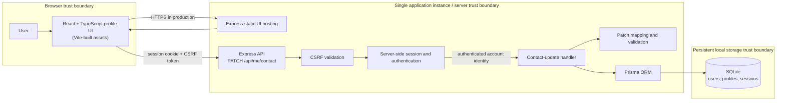

# Architecture Overview

| Metadata | Value |
|---|---|
| Story/source identity | SCRUM-8 — Update User Contact Information; JIRA source revision `2026-10-07T00:02:18.991+0530` |
| Requirements path and committed revision | `docs/sdlc/requirements.md`, committed at `da13f603f7050bd816cfc8cdaaf78339d74d4f40` |
| Requirements approval | APPROVED at the recorded revision; human approval recorded 2026-10-07 |
| Architecture revision | 1 |
| Architecture status | READY_FOR_REVIEW |
| Human approval status | APPROVED |

Architecture for a greenfield SCRUM-8 prototype. The requirements baseline is approved and committed at the revision recorded above. Requirements reconciliation AQ-005 is resolved against that baseline; the architecture preserves the confirmed PATCH semantics and separately records the human-selected prototype stack and topology as architecture decisions. READY_FOR_REVIEW is not architecture approval. No implementation or deployment is part of this document.

# Architecture Drivers

| Driver | Requirements / decision evidence |
|---|---|
| Authenticated self-service updates to the three in-scope profile contact fields | FR-001–FR-002; AC-001–AC-002; DR-001; SR-001–SR-004 |
| Partial updates preserve omitted fields, including email; blank email is invalid while optional blank phone/address clears | FR-003, FR-005–FR-006, FR-008; AC-003, AC-007, AC-009–AC-012; BR-002–BR-005; DR-002, DR-005–DR-007; RQ-018, RQ-022, RQ-025–RQ-026 |
| Supplied contact values are trimmed; email remains case-preserving, phone is exactly 10 ASCII digits, and address is free text of 1–500 trimmed characters | FR-003; AC-003–AC-005, AC-012; DR-002–DR-004; RQ-022–RQ-024 |
| Contact email is separate from login username, need not be unique, and does not trigger email workflows | AC-013; DR-008; RQ-027 |
| Complete validation precedes mutation; every validation or persistence failure preserves all contact data | FR-006; AC-007–AC-008, AC-011; DR-005; RQ-025–RQ-026 |
| Exact success and persistence-failure feedback | FR-004, FR-007; AC-006, AC-008 |
| Authenticated session-scoped self-update and CSRF protection | AC-014–AC-015; SR-001–SR-005; RQ-028–RQ-029 |
| React/TypeScript/Vite, Node.js/TypeScript/Express, SQLite/Prisma, test stack, and single-instance deployment | Confirmed architecture choices from human clarification AQ-002; not business or project requirements |
| Performance, availability, scalability, and numerical reliability targets | None specified. No targets are invented. |

# Existing-System Context

- **VERIFIED:** `docs/sdlc/requirements.md` is explicitly approved and committed at `da13f603f7050bd816cfc8cdaaf78339d74d4f40`; the worktree copy matches that commit. It identifies SCRUM-8 source revision `2026-10-07T00:02:18.991+0530`, consistent with `.sdlc/input/source-manifest.json` and `.sdlc/input/user-story.md`.
- **VERIFIED:** This is a greenfield prototype. The tracked repository contains SDLC and agent documentation but no application implementation, dependencies, schema/migrations, tests, or deployment definition. `src` and `tests` are empty. `README.md` contains only the repository title.
- **VERIFIED:** Applicable SDLC documentation rules are in `.github/instructions/sdlc-documents.instructions.md`. `.github/copilot-instructions.md` and `AGENTS.md` are absent.
- **VERIFIED:** No existing application framework, persistence layer, authentication implementation, deployment environment, CI/CD definition, or ADR is present to preserve.
- **PROPOSED:** The approved story requires availability from a user-profile page, but no such application page is present in this greenfield repository. The standalone prototype will provide the profile UI rather than presume integration with an unavailable host application.
- **APPROVED REQUIREMENTS:** The current baseline makes email mandatory and nonblank in stored profile data, retains omitted email during partial updates, rejects blank email, and specifies phone/address normalization, null/type rejection, atomic failure behavior, account identity separation, session ownership, and CSRF controls.
- **CONFIRMED HUMAN ARCHITECTURE DECISIONS:** Human clarification AQ-002 selected this repository for a standalone prototype, its stack, test tools, single-instance deployment, and explicit exclusions. These are recorded as architecture decisions below, not as requirements in the approved baseline.
- **RESOLVED BASELINE RECONCILIATION:** AQ-005 is resolved by the revised, explicitly approved requirements committed at `da13f603f7050bd816cfc8cdaaf78339d74d4f40`. AC-003 and DR-002 now agree that email omission retains the valid stored email. No requirements conflict remains.

# Proposed Architecture

Build one TypeScript application. Vite builds a React profile UI; one Node.js/Express server serves that built UI and the JSON API. Express authenticates username/password accounts using Argon2id password hashes and server-side sessions in HttpOnly cookies (`SameSite`; `Secure` when HTTPS). A session-derived account identity scopes `PATCH /api/me/contact`; the request has no target-user identifier. CSRF protection guards state-changing requests.

The handler loads the authenticated user's profile, validates every submitted contact field and constructs a complete candidate without writing. Email omission retains the stored mandatory email. Optional phone/address omission retains the stored value; blank/whitespace clears it. Null and non-string submitted values are rejected. A valid patch is saved in one Prisma/SQLite database transaction; any failure leaves the prior contact record unchanged. The UI displays the required success or failure feedback. SQLite resides on persistent local storage with one application instance.

Password recovery is outside scope. Contact email is separate from the immutable login username, is not unique, and triggers no verification or notification email. No external address services, identity provider, queues, microservices, Kubernetes, or multi-instance topology are introduced.

# Component Diagram



The application, API, authentication, storage, and UI are all proposed prototype components; there are no existing application components in the repository. Browser, server, and persistent local storage are separate trust boundaries. HTTPS is required for production use of the `Secure` session cookie.

# Components and Responsibilities

| Component | Responsibility | Inputs and outputs | Dependencies | Requirements served |
|---|---|---|---|---|
| React + TypeScript profile UI | Present login/profile workflows and editable contact values; display required feedback. | User input; PATCH request and success/validation/save feedback. | Express-hosted Vite build, session cookie, CSRF token. | FR-001, FR-004, FR-007; AC-001, AC-006, AC-008, AC-014–AC-015 |
| Vite build and Express static hosting | Build and serve the UI from the single application instance. | TypeScript/React source and build artifacts; browser assets. | Vite, Node.js/Express. | FR-001, FR-004 |
| Express authentication/session boundary | Authenticate accounts; verify server-side session and expose session-derived principal to routes. | Login credentials/cookie; authenticated principal or authentication rejection. | Argon2id password verification; server-side session persistence; SQLite/Prisma. | SR-001–SR-004; AC-014 |
| CSRF middleware | Reject state-changing requests lacking valid CSRF proof associated with the authenticated session. | Session cookie and CSRF token/header; allow or reject. | Express request pipeline and session. | SR-005; AC-015 |
| Contact-update handler | Accept only current-user PATCH operations; orchestrate profile read, patch validation, transaction, and feedback. | Authenticated principal and JSON patch; success or categorized failure. | Session, validator, Prisma. | FR-001–FR-008; AC-001–AC-015; SR-001–SR-005 |
| Patch mapper and validator | Validate input types/presence; apply trim, blank, retention, clear, and field-specific rules to a candidate profile. | Stored profile plus submitted JSON fields; complete valid candidate or field errors. | Approved requirements-defined validation behavior. | FR-003, FR-005–FR-006, FR-008; AC-003–AC-005, AC-007, AC-009–AC-012; BR-001–BR-005; DR-002–DR-007 |
| Prisma persistence layer | Own users, profiles, and server-side sessions in SQLite; atomically save each valid contact patch. | Account/profile/session operations; committed result or failure. | Prisma ORM and SQLite database on persistent local storage. | FR-002, FR-006; DR-001–DR-008 |

# Technology Decisions

### AD-001 — React, TypeScript, and Vite for the UI

- **Decision:** Build the prototype profile UI with React and TypeScript, using Vite for development/build.
- **Reason:** This is the explicitly selected UI stack for the standalone prototype; Vite provides a direct build path for a single server to host.
- **Alternatives considered:** Server-rendered Express templates or another SPA framework; neither was selected by the human.
- **Trade-offs:** A separate UI build adds a build step and client/server boundary; it keeps the prototype UI modular and typed.
- **Requirement(s):** FR-001, FR-004; AC-001, AC-006. The technology choice is not mandated by the requirements.
- **Status:** CONFIRMED.
- **Evidence/status basis:** Explicit human architecture decision AQ-002; requirements commit `da13f603f7050bd816cfc8cdaaf78339d74d4f40` does not mandate this stack.

### AD-002 — Node.js, TypeScript, and Express API

- **Decision:** Implement the API on Node.js with TypeScript and Express, including `PATCH /api/me/contact`.
- **Reason:** Explicitly selected for the prototype and supports the specified API boundary and single-instance static hosting.
- **Alternatives considered:** Other Node frameworks, another language/runtime, or a separate API service; not selected and unnecessary for the stated single-instance scope.
- **Trade-offs:** Express is a small routing foundation; validation, session, and CSRF middleware must be deliberately composed.
- **Requirement(s):** FR-001–FR-008; SR-001–SR-005. The framework/runtime choice is not mandated by the requirements.
- **Status:** CONFIRMED.
- **Evidence/status basis:** Explicit human architecture decision AQ-002; requirements commit `da13f603f7050bd816cfc8cdaaf78339d74d4f40` does not mandate this stack.

### AD-003 — SQLite with Prisma ORM

- **Decision:** Store account/profile and server-side session data using SQLite on persistent local storage, accessed through Prisma ORM.
- **Reason:** Explicitly selected for a standalone, single-instance prototype; it avoids operating a separate database service while retaining transactional persistence.
- **Alternatives considered:** In-memory storage (not durable), a remote database service (adds infrastructure), or a different ORM; not selected.
- **Trade-offs:** SQLite suits one application instance and local persistence; it does not provide the multi-instance deployment excluded by the prototype decision. Database-file permissions, backups, and persistence volume must be managed by the deployment environment.
- **Requirement(s):** FR-002, FR-006; DR-001, DR-005. SQLite/Prisma and local persistence are selected architecture choices, not requirements.
- **Status:** CONFIRMED.
- **Evidence/status basis:** Explicit human architecture decision AQ-002; requirements commit `da13f603f7050bd816cfc8cdaaf78339d74d4f40` does not mandate the database or ORM.

### AD-004 — Local username/password authentication and sessions

- **Decision:** Use a separate immutable username for login, Argon2id password hashes, and server-side sessions. Send session identifiers in HttpOnly, SameSite cookies and set Secure when served over HTTPS. Contact email is not an identity/recovery field.
- **Reason:** These are explicit prototype authentication constraints; they prevent contact-email updates from implicitly changing account identity.
- **Alternatives considered:** External identity provider, email-as-login, client-side sessions, plaintext/reversible passwords, or password-recovery workflow; explicitly excluded or inconsistent with the clarification.
- **Trade-offs:** The application owns account/session security and password-hash operations. Session expiry, password policy, provisioning, and session-store cleanup still need concrete implementation policy; password recovery remains outside scope.
- **Requirement(s):** FR-001; SR-001–SR-004; DR-008. Specific local credential, password-hash, and server-side session technologies are architecture decisions, not requirements.
- **Status:** CONFIRMED.
- **Evidence/status basis:** Explicit human architecture decisions AQ-002 and AQ-003; requirements commit `da13f603f7050bd816cfc8cdaaf78339d74d4f40` does not mandate password hashing or session implementation details.

### AD-005 — Session-derived identity and CSRF-protected PATCH

- **Decision:** Implement `PATCH /api/me/contact`; derive the account solely from the authenticated session, accept no target user ID, and require CSRF proof for the state-changing request.
- **Reason:** Explicit API and authorization constraints; `SameSite` cookies are defense-in-depth and do not replace CSRF validation.
- **Alternatives considered:** Client-selected account IDs, a PUT/full replacement operation, or relying only on cookie SameSite; rejected because they weaken the specified ownership or partial-update semantics.
- **Trade-offs:** PATCH requires preserving field presence and precise null/blank handling. A synchronizer token associated with the server-side session is the proposed CSRF mechanism; the exact token delivery/header convention must be consistent between the React UI and Express middleware.
- **Requirement(s):** FR-001, FR-005–FR-006; AC-009, AC-014–AC-015; SR-001–SR-005.
- **Status:** CONFIRMED.
- **Evidence/status basis:** Session-derived self-identity and CSRF are approved by SR-004–SR-005 and AQ-002. The synchronizer-token mechanism is a PROPOSED implementation detail, not mandated by the requirements.

### AD-006 — Validate first, then persist in one transaction

- **Decision:** Validate the entire submitted patch and complete candidate before writing; persist all submitted changes in one Prisma/SQLite transaction. Any validation, write, or transaction failure leaves all stored contact information unchanged.
- **Reason:** Preserves the explicit all-or-nothing behavior and prevents partial profile updates.
- **Alternatives considered:** Per-field writes or committing valid fields while rejecting invalid fields; both violate FR-006.
- **Trade-offs:** Validation requires a consistent current profile snapshot; read/patch/write must avoid stale updates. Keep the transaction limited to database work and do not perform external calls within it.
- **Requirement(s):** FR-002–FR-003, FR-006; AC-007–AC-008, AC-011; DR-005; RQ-026.
- **Status:** CONFIRMED.
- **Evidence/status basis:** Approved all-fields-unchanged behavior in FR-006, AC-007–AC-008, DR-005, and RQ-026; transaction is the selected architecture control.

### AD-007 — One-instance deployment and selected test stack

- **Decision:** Deploy one application instance serving the Vite-built UI and Express API with SQLite on persistent local storage. Use Vitest for unit tests, Supertest for API integration tests, and Playwright for end-to-end tests.
- **Reason:** Explicitly selected prototype topology and test tools; no distributed runtime is needed for this scope.
- **Alternatives considered:** Microservices, queues, Kubernetes, multi-instance hosting, an external identity provider, or alternate test runners; explicitly not required or selected.
- **Trade-offs:** One instance avoids distributed coordination but is a single runtime failure domain. Persistent storage and backups must be ensured. Browser tests require a runnable integrated application.
- **Requirement(s):** FR-001–FR-008; SR-001–SR-005. The selected test tools and one-instance deployment are not requirements.
- **Status:** CONFIRMED.
- **Evidence/status basis:** Explicit human architecture decision AQ-002; requirements commit `da13f603f7050bd816cfc8cdaaf78339d74d4f40` does not mandate a deployment topology or test runner.

# Data Flow

1. **Successful update:** The authenticated user opens the React profile UI. The browser sends `PATCH /api/me/contact` with the session cookie, CSRF token, and only fields being updated. Express verifies CSRF and session, derives the user identity from the session, then loads the profile. The handler rejects unknown fields and invalid types, trims email/phone/address outer whitespace, preserves email case and address internal whitespace/line breaks, applies omission/clear semantics, and validates all submitted changes. It constructs the complete candidate, then commits the changed contact fields in one Prisma transaction. On commit, return success and display **“Contact information updated successfully.”**
2. **Validation failure:** Blank/whitespace-only email when explicitly supplied, invalid email format, invalid phone/address, null, non-string, malformed JSON, or unsupported fields causes rejection before a write. Omitted email retains the stored value and is not a validation failure. Return field-specific validation feedback. Every stored contact value remains unchanged.
3. **Authentication/authorization failure:** Reject a missing/invalid session. The account is derived from that session, so the API has no target user to substitute. Do not perform a write or disclose another account's profile.
4. **CSRF failure:** Reject a state-changing request without valid CSRF proof before invoking the update handler or persistence.
5. **Persistence failure:** Roll back the transaction, return a non-success save failure, and display **“Unable to update contact information. Please try again.”** All pre-update contact data remains stored.
6. **Response delivery:** Return success only after the transaction commits. A lost response after commit can leave the browser uncertain; reloading the profile obtains the persisted state. No external email, verification, or address-service request is made.

# Interfaces / APIs

**API:** `PATCH /api/me/contact` — authenticated, CSRF-protected JSON partial update. The session identity is authoritative. The request MUST NOT accept a target user ID. Authentication and CSRF failures are rejected before profile mutation.

**Request body example:**

```json
{
  "email": "Alice@example.test",
  "phone": "2125550100",
  "mailingAddress": "42 Example Road\nUnit 3"
}
```

Only `email`, `phone`, and `mailingAddress` are accepted. Omitted keys retain the corresponding existing stored value, including email; email is mandatory in the resulting stored profile, not in every PATCH body. A JSON object with no contact keys is a proposed valid no-op patch and may return success without a database write. Reject malformed JSON and unknown keys rather than silently ignoring likely client mistakes.

| Field | Omitted | Submitted string | Null / non-string |
|---|---|---|---|
| `email` | Retain the existing mandatory contact email. | Trim leading/trailing whitespace; reject blank; validate email format; preserve letter case when stored. Email is not unique, is not a login/recovery identifier, and triggers no verification or notification email. | Reject the entire update and identify email. |
| `phone` | Retain existing value. | Trim surrounding whitespace. Empty after trim clears. Otherwise require exactly 10 ASCII digits (`0`–`9`), with no formatting characters or country-code prefix. | Reject the entire update and identify phone. |
| `mailingAddress` | Retain existing value. | Trim leading/trailing whitespace. Empty after trim clears. Otherwise require 1–500 characters after trimming. Preserve internal spaces and line breaks. No locale, postal code, geocoding, or external verification rules. | Reject the entire update and identify mailing address. |

Email remains mandatory, valid, and nonblank in the stored profile; omission is not a clear operation and retains that stored value. Explicit blank/whitespace-only email, any submitted null or non-string contact field, or any invalid supplied value rejects the entire patch. Trim surrounding whitespace from supplied values before field validation; preserve email letter case and address internal spacing and line breaks. Validate every supplied field and the complete resulting profile before database mutation. Validation feedback identifies invalid fields; exact validation wording and HTTP status conventions are not specified. On persistence failure show exactly **“Unable to update contact information. Please try again.”** On success show exactly **“Contact information updated successfully.”** Do not expose internals or stored contact data in errors.

The endpoint should use the application's standard JSON error envelope and status conventions. A CSRF token is associated with the authenticated server-side session and sent by the React client in the agreed request header; it is not accepted as a substitute for authentication. Concurrency handling must not let an omitted field overwrite a concurrent update with stale data. Retry policy and status codes for conflict, authentication, CSRF, malformed input, and validation should be documented in the API implementation contract.

# Database / Storage

SQLite is the single durable local store, accessed through Prisma. Store an account with immutable unique login username and Argon2id password hash, and an associated profile with a non-null contact email plus nullable/optional phone and mailing-address columns. Contact email has no uniqueness constraint. Email is distinct from username and is not used for recovery. Store email case as submitted after outer trimming. Store phone as the trimmed ten-digit string or cleared/null value. Store address as trimmed free text (1–500 characters when nonblank), preserving internal spaces and line breaks; clear as the profile's absent/null representation. Enforce username uniqueness for login identity.

Persist server-side session state in server-controlled storage, preferably in SQLite for this one-instance prototype, with expiry data and cleanup. Use a session identifier in the cookie, not client-held authoritative account state. Do not store plaintext passwords; hash and verify with Argon2id. Keep credentials/session secrets outside source control, restrict access to the database file, and back up the persistent database according to prototype data-retention expectations.

For a PATCH, load the current profile and build a complete candidate while retaining omitted fields. Validate the whole candidate before writes. Apply all submitted contact-field changes in one Prisma transaction. On validation or transaction failure, roll back and preserve the prior email, phone, and address exactly. Perform no external effects within the transaction. A schema migration should create account, profile, and session structures before use; rollback must not leave partially applied contact fields. SQLite is selected for one application instance; multi-instance deployment is explicitly out of scope.

Concurrent PATCH operations must apply omitted-field semantics against a consistent latest profile. Use a transaction and suitable SQLite transaction/locking or version-check approach; if the implementation detects a conflict, abort the patch without partial persistence and have the client reload/retry. The specific concurrency response is an implementation contract detail, not defined by the requirements.

# Authentication & Authorization

Provide local username/password accounts. Login username is separate from contact email and immutable. Store only Argon2id password hashes. Password recovery is outside prototype scope. Authenticate with a server-side session; issue an opaque session cookie configured HttpOnly and SameSite, and Secure when served over HTTPS. Rotate session identity after authentication and invalidate sessions on logout. Session lifetime and password policy must be selected and documented during implementation without changing contact-update behavior.

Protect `PATCH /api/me/contact` with CSRF validation bound to the authenticated session. Derive account identity only from the session; do not accept a target account ID. Update only that principal's profile. No additional reauthentication is required. Contact email changes do not modify username, password, recovery identity, or trigger verification/notification mail. Failed authentication, CSRF, or authorization attempts do not write profile data.

# Secrets Management

No secret values belong in this architecture document or source control. The deployment must provide a high-entropy session-signing/secret value through a runtime environment or protected local configuration with access restricted to the application process; rotate it by invalidating/reissuing sessions. Argon2id parameters should use a maintained implementation and be configured according to the application's security review; no numerical cost is invented here. SQLite contains password hashes, sessions, and contact data; protect the persistent file and its backups with OS/deployment access controls. The prototype has no external service credentials.

# Error Handling

| Failure | System behavior | User feedback |
|---|---|---|
| Explicit email is blank, null, non-string, or invalid; email omission uses existing stored value | Reject before write; identify email on validation response | Field-identifying validation message |
| Phone is null/non-string or a nonblank string is not exactly 10 ASCII digits after trim | Reject entire patch before write | Field-identifying validation message |
| Address is null/non-string or trimmed nonblank length is outside 1–500 | Reject entire patch before write | Field-identifying validation message |
| Malformed JSON, unknown field, unauthenticated session, or invalid CSRF token | Reject before persistence; do not expose profile data | Existing application-level request/authentication feedback; exact wording not specified |
| Valid patch cannot be saved due to persistence/system failure | Roll back transaction; no contact field changes | **“Unable to update contact information. Please try again.”** |
| Successful commit | Respond only after commit | **“Contact information updated successfully.”** |

Do not expose stack traces, SQL/Prisma details, session IDs, hashes, or contact values. A failed transaction must never produce a success-shaped response. Validation errors identify fields but do not echo sensitive stored data.

# Observability

No monitoring product or observability target is selected or required. Emit privacy-safe structured outcome events for authentication/CSRF denial, validation category, transaction success/failure, and request correlation where available. Do not log raw request bodies, usernames, contact values, passwords, hashes, cookies, CSRF tokens, or session IDs. Keep local logs separate from the SQLite database. Define retention and access with deployment operations; do not introduce an external monitoring service for this prototype.

# Performance / Scalability

No performance or availability targets are specified. The request performs a bounded profile read, in-process validation, and one local SQLite transaction. No external address, email, or identity calls are on the request path. One application instance and local SQLite storage are explicit prototype constraints; multi-instance scaling is not a design objective. Database contention and local disk failure are the primary operational limits. Do not invent latency or throughput targets.

# Deployment Model

Build the React/TypeScript UI with Vite and run one Node.js/TypeScript Express instance that serves the built UI and API. Persist SQLite on a durable local storage location that survives process restarts and releases; do not place the database only in ephemeral build/container storage. Use HTTPS in deployed environments so session cookies can be Secure. Configure the production session secret outside source control and restrict access to the database and backups. Apply Prisma schema migrations as a controlled release step with a backup/rollback plan.

There are no microservices, queues, Kubernetes, multiple application instances, or external identity provider. A single instance is a deliberate prototype limitation and single failure domain. No actual hosting platform or CI/CD system is specified; select it only as part of deployment implementation.

# Failure Scenarios

| Scenario | Detection | System Behavior | Data Effect | Recovery |
|---|---|---|---|---|
| Blank/whitespace-only email, null, non-string, or invalid email submitted | Request parser and email validator | Reject patch; identify email | No contact fields change | Correct the supplied email or omit the field to retain the stored value |
| Phone contains formatting, non-ASCII digit, wrong length, or wrong type | Phone validator | Reject entire patch | No contact fields change | Submit exactly 10 ASCII digits or clear |
| Address exceeds 500 trimmed characters or is wrong type | Address validator | Reject entire patch | No contact fields change | Submit free text within limit or clear |
| Explicit blank/whitespace optional value | Patch mapper after trim | Map to clear; persist with other submitted fields atomically | Clears only on successful transaction | On later failure, transaction restores all prior values |
| Unauthenticated or invalid session | Session middleware | Reject before handler mutation | No contact fields change | Authenticate again |
| Invalid/missing CSRF proof | CSRF middleware | Reject state-changing request | No contact fields change | Obtain fresh page/token and retry |
| Database write/commit failure | Prisma/SQLite transaction error | Roll back and display exact save-failure message | All old contact data remains unchanged | Retry after service/storage issue is resolved |
| Concurrent patch conflicts | Transaction/version/locking check | Abort stale/conflicting update rather than overwrite omitted fields | One complete patch commits or rejected patch has no effect | Reload latest profile and resubmit |
| Commit succeeds but response is lost | Browser timeout/network failure | Client may not know the outcome; reload profile before retrying | A complete patch may already be committed | Fetch current profile and reconcile; no external side effect needs deduplication |
| Persistent local database file unavailable/corrupt | SQLite open/read/write error | Fail closed; do not claim success | No successful write; existing data may require restore if corrupted | Restore protected backup and investigate storage |

# Testing Architecture

The repository has no application implementation or test setup. These tests are architecture requirements, not tests executed in this phase.

| Test level/tool | Architectural behavior to verify |
|---|---|
| Unit — Vitest | PATCH field-presence mapping; omitted email/phone/address retain; blank optional phone/address clear; blank email rejects; all null/non-string values reject; email trims outer whitespace but preserves case; phone trims then accepts exactly ten ASCII digits only; address trims ends, preserves internal spacing/newlines, and accepts 1–500 trimmed characters only. |
| Unit — Vitest | Validate all supplied values and the complete candidate before persistence; invalid one-field patch does not mutate any in-memory/stored candidate. Test email format, whitespace-only values, Unicode digits, formatted phone values, and address length boundaries. |
| API integration — Supertest | `PATCH /api/me/contact` authentication and CSRF requirements; no target-user ID accepted; session identity scopes update to own account; contact email is not login identity; no email uniqueness/verification/notification behavior. |
| API integration — Supertest | Omitted fields including email retain, valid submitted fields update, blank optional values clear, blank email rejects, and all changes are atomic. Confirm exact success text and validation identifies each invalid field. |
| Transaction integrity — Supertest/SQLite test database | Force transaction/write/commit failures after validation; assert email, phone, and address all retain their pre-request values. Invalid multi-field patch writes none of its valid sibling fields. |
| Security — Supertest | Reject unauthenticated, invalid-session, and CSRF requests without writes. Altered body IDs cannot select a different user. Passwords are not stored plaintext; session cookies have HttpOnly/SameSite and Secure under HTTPS configuration. |
| End-to-end — Playwright | Login, visit profile UI, submit valid partial updates, verify omission retention for all fields and clear behavior for optional fields, and assert exact visible feedback; validation/persistence failures leave persisted values unchanged. |
| Deployment/integration | Built Vite UI is served by Express; SQLite data survives application restart using persistent local storage; migrations initialize the schema. |

# Security Considerations

Hash passwords with Argon2id; never store or log plaintext credentials. Use opaque server-side sessions, HttpOnly/SameSite cookies, Secure cookies over HTTPS, session rotation on login, expiration, and logout invalidation. Protect all state-changing requests with CSRF tokens validated against the session; cookie SameSite alone is insufficient. These implementation mechanisms follow the explicit human architecture decisions; the approved requirements specifically require authenticated session ownership and CSRF protection (SR-004–SR-005) without prescribing hash, cookie, or token implementation details.

The browser request is untrusted. Validate JSON shape, supported fields, types, field presence, and normalized values on the server. Derive profile ownership only from authenticated session state; reject target-user identifiers and mass assignment. Validate the complete update before transaction writes and enforce atomicity.

Contact email, phone, address, username, password hashes, sessions, and CSRF tokens are sensitive. Do not expose them in logs/errors or permit another account to read/update them. Contact email is non-unique and separate from immutable login username; it must not trigger verification or notification emails and is not used for password recovery (AC-013, DR-008, RQ-027). Restrict local SQLite file and backup access; use HTTPS for deployed authenticated traffic. Password recovery and external identity integrations are outside scope.

# Requirement-to-Component Traceability

| Requirement ID | Component(s) | Interface / Flow | Architectural Control | Verification Approach |
|---|---|---|---|---|
| FR-001 | React UI, Express API, session auth | Profile page to authenticated PATCH | Only the session owner can change email, phone, or address | Playwright; Supertest authorization |
| FR-002 | Validator, handler, Prisma/SQLite | Valid partial PATCH | Persist only a valid resulting profile | Supertest persistence test |
| FR-003 | JSON parser, patch validator | PATCH field normalization and validation | Trim supplied values; reject invalid, blank email, null, and non-string | Vitest and Supertest |
| FR-004 | React UI, feedback mapping | Successful response | Exact confirmation after commit | Playwright exact-text check |
| FR-005 | Patch mapper, profile persistence | Omitted field | Retain stored value for any omitted contact field, including email | Unit and API integration tests |
| FR-006 | Handler, Prisma/SQLite transaction | Validation/persistence failure | Validate before mutation; atomic write preserves all existing fields on failure | Transaction failure-injection test |
| FR-007 | Express response, React UI | Persistence failure | Roll back and show exact required failure text | Supertest and Playwright |
| FR-008 | Patch mapper, validator, persistence | Blank optional phone/address | Trim; clear only after successful atomic save | Vitest and Supertest |
| AC-001 | React UI, Express API, session auth | Own-profile update | Expose only the three in-scope fields and scope identity to session | Playwright |
| AC-002 | Session auth, Express handler | Cross-user attempt | No target-user ID or administrative bypass | Supertest authorization tests |
| AC-003 | Patch mapper, email validator | Email supplied or omitted | Stored email remains valid/nonblank; omission retains; blank rejects; preserve case after trim | Vitest and API contract tests |
| AC-004 | Phone validator, patch mapper | Phone PATCH field | Trim; only 10 ASCII digits accepted; blank clears; omission retains | Boundary/unit and API tests |
| AC-005 | Address validator, patch mapper | Address PATCH field | Trim ends; preserve internal spaces/newlines; enforce 1–500 characters; blank clears | Boundary/unit and API tests |
| AC-006 | React UI, feedback mapping | Success | Exact visible success text after commit | Playwright |
| AC-007 | Validator, persistence | Invalid patch | Reject entire patch, identify invalid field, preserve every stored value | Supertest failure/data-integrity tests |
| AC-008 | Prisma/SQLite, feedback | Persistence failure | Transaction rollback and exact failure text | Failure-injection and Playwright tests |
| AC-009 | Patch mapper, persistence | Omitted contact field | Retain prior value for email, phone, and address | Unit and API integration tests |
| AC-010 | Patch mapper, persistence | Omission versus blank optional field | Omission retains; blank/whitespace clears phone/address | Contract and persistence tests |
| AC-011 | JSON parser, validator, persistence | Null or non-string field | Reject entire patch before writes | API type-validation and unchanged-state tests |
| AC-012 | Patch mapper and field validators | Supplied string normalization | Trim outer whitespace; preserve email case and address internal whitespace/newlines | Vitest normalization tests |
| AC-013 | Account/profile model, email workflow boundary | Email update | Email is separate from immutable username, not unique, and triggers no email workflow | Schema/constraint inspection; integration test |
| AC-014 | Session auth, Express handler | Authenticated self-update | Require session and derive owner only from it; reject cross-user changes | Supertest session/authorization tests |
| AC-015 | CSRF middleware | State-changing PATCH | Reject invalid/missing CSRF proof before mutation | Supertest CSRF tests; assert no write |
| BR-001 | Validator | All submitted contact fields | Persist only if complete patch validates | Unit tests |
| BR-002 | Profile model, API contract | Required/optional data | Email nonblank in storage; phone/address optional | Schema and contract tests |
| BR-003 | Patch mapper | Omitted fields | Retain current stored value for all contact fields | Unit/API integration tests |
| BR-004 | Patch mapper, validator | Explicitly blank optional field | Clear phone/address; exempt blank from nonblank format checks | Unit/API integration tests |
| BR-005 | Validator | Blank email, null, non-string | Reject invalid field and entire patch | Unit/API validation tests |
| DR-001 | Profile model, Prisma/SQLite | Profile storage | Store email, phone, and address on the user's profile | Schema inspection and integration test |
| DR-002 | Email validator, profile model | Email input/storage | Maintain valid nonblank stored email; omission retains; supplied email trims and preserves case | Unit, API, and persistence tests |
| DR-003 | Phone validator, patch mapper | Phone input/storage | Omission retains; blank clears; otherwise exactly 10 ASCII digits after trim | Vitest/Supertest boundary tests |
| DR-004 | Address validator, patch mapper | Address input/storage | Omission retains; blank clears; otherwise 1–500 trimmed free-text characters preserving interior whitespace/newlines | Vitest/Supertest boundary tests |
| DR-005 | Handler, Prisma/SQLite | Validation/write transaction | Failure leaves all previous contact fields unchanged; no subset writes | Transaction failure-injection tests |
| DR-006 | Patch mapper, profile persistence | Partial update | Omission retains any contact field | Unit/API integration tests |
| DR-007 | Patch mapper, validator | Blank/whitespace semantics | Clear optional phone/address only; reject blank email | Unit/API persistence tests |
| DR-008 | Account/profile model, email workflow boundary | Identity and email update | Email non-unique, separate from username, no verification/notification messages | Schema/constraint inspection; integration test |
| SR-001 | Express session authentication | Authenticated PATCH | Require existing authenticated session; no extra reauthentication | Supertest session tests |
| SR-002 | Session auth, Express handler | Profile ownership | Restrict update to authenticated user's own profile | Supertest authorization tests |
| SR-003 | All components | Account/contact data handling | Apply existing privacy/security policies; minimize and protect sensitive data | Security review and privacy-safe log inspection |
| SR-004 | Session middleware, contact handler | Identity resolution | Derive principal from session; accept no client-selected target identity | Supertest identity-tampering tests |
| SR-005 | CSRF middleware | State-changing PATCH | Verify CSRF protection bound to authenticated request before mutation | Supertest CSRF rejection tests; assert no write |

Every approved requirement ID is allocated above. AC-003 and DR-002 agree with the approved partial-update contract: an omitted email retains its valid stored value; it is not mandatory in each request.

# Architecture Risks

| Risk ID | Risk | Impact | Mitigation | Remaining Decision |
|---|---|---|---|---|
| AR-001 | Earlier approved baseline required email in every update, conflicting with the clarified partial-update behavior. | Had the mismatch persisted, the API contract and architecture traceability would have disagreed. | **RESOLVED:** requirements AC-003 and DR-002 were reconciled, approved, and committed at `da13f603f7050bd816cfc8cdaaf78339d74d4f40`; architecture now follows omission-retains semantics. | None; AQ-005 resolved. |
| AR-002 | Single application instance and local SQLite form one runtime/storage failure domain. | Instance or local storage failure can make the prototype unavailable or risk data loss. | Use persistent storage, restricted file access, and tested backup/restore; do not claim a multi-instance guarantee. | No open architecture choice; confirmed prototype decision AQ-002. |
| AR-003 | Session and CSRF configuration can be insecure if cookie and middleware policies are incomplete. | Account takeover or cross-site state change. | Apply HttpOnly/SameSite, Secure over HTTPS, server-side sessions, CSRF validation, session rotation/expiry, and security tests. | Implementation must document expiry, secret source, and token convention. |
| AR-004 | A committed update with a lost response may be uncertain to the client. | User may retry without knowing whether the first update succeeded. | Reload current profile before retry; no external side effects require deduplication. | Non-blocking implementation behavior. |
| AR-005 | Concurrent PATCH operations can race while applying omission semantics. | A stale partial update could overwrite a newer contact value. | Read/construct/write against a consistent current profile; use transaction/locking or version checks, abort conflicts without partial writes, and test concurrency. | Select transaction/conflict response in implementation; must preserve approved field semantics. |
| AR-006 | The requirement specifies a valid email format without prescribing a concrete validator contract. | Different validators may accept different edge-case addresses. | Select and test a maintained validator in implementation; do not change the required trim, nonblank, omission-retains, or case-preservation behavior. | Non-blocking implementation contract detail; no new business rule inferred. |

# Assumptions

No assumptions are used to fill gaps in the approved requirements or human decisions. The stack and single-instance topology are confirmed architecture decisions, not requirement constraints. Implementation details not specified (session expiry, password policy, exact CSRF-token transport, API error status/envelope, hosting platform, email-validator edge cases, backup cadence, and concurrency conflict response) remain implementation decisions; they do not authorize changes to the approved functional behavior. Contact data and account/session state are proposed to be stored in SQLite using Prisma, consistent with confirmed decision AD-003.

# Open Decisions

| ID | Question | Why it matters | Options and trade-offs | Recommendation | Blocking | Status | Human answer and affected sections when resolved |
|---|---|---|---|---|---|---|---|
| AQ-001 | What mailing-address format, normalization, and length rules apply? | Needed testable address validation. | Resolved by approved AC-005, DR-004, and RQ-024: free text; trim ends; preserve internal spaces/line breaks; 1–500 characters after trim; no country-specific, postal-code, geocoding, or external validation. | Apply the approved rules without adding address-service validation. | NO | RESOLVED | Human clarification is now captured in requirements committed at `da13f603f7050bd816cfc8cdaaf78339d74d4f40`. Affects Drivers, Proposed Architecture, AD-006, API, Storage, Testing, Traceability, Risks. |
| AQ-002 | What application context, stack, API, auth, persistence, test, and deployment choices apply? | No existing application architecture was found to preserve. | Resolved: standalone prototype; React/TypeScript/Vite, Node.js/TypeScript/Express, SQLite/Prisma, local username/password plus sessions, Vitest/Supertest/Playwright, single-instance deployment; distributed/external identity options excluded. | Use these as confirmed architecture decisions, not requirements. | NO | RESOLVED | Explicit human architecture decision received 2026-10-07; the requirements baseline deliberately does not mandate the stack or deployment topology. Affects all architecture sections and AD-001–AD-007. |
| AQ-003 | What is the contact-email relationship to account identity and email workflows? | Prevents contact updates from changing authentication behavior. | Resolved by approved AC-013, DR-008, and RQ-027: separate from immutable username, non-unique, no verification/notification email, and no password recovery. | Preserve that separation. | NO | RESOLVED | Captured in requirements committed at `da13f603f7050bd816cfc8cdaaf78339d74d4f40`. Affects Drivers, AD-004, API, Storage, Authentication, Security, Testing, Traceability. |
| AQ-004 | What are PATCH field-presence, type, null, normalization, and phone rules? | Required exact behavior for partial updates and validation. | Resolved by approved AC-003–AC-005, AC-009–AC-012, BR-002–BR-005, DR-002–DR-007, and RQ-022–RQ-026: omission retains every field including email; blank email rejects; null/non-string rejects entire patch; optional blank phone/address clears; phone is exactly 10 ASCII digits after trim. | Follow the approved requirements baseline. | NO | RESOLVED | Requirements committed at `da13f603f7050bd816cfc8cdaaf78339d74d4f40` capture the clarified semantics. Affects Drivers, AD-005–AD-006, Data Flow, API, Storage, Error Handling, Testing, Traceability. |
| AQ-005 | Reconcile the approved email-on-every-update wording with the confirmed partial PATCH behavior and incorporate clarified prototype requirements into the requirements baseline. | A mismatch would leave architecture behavior inconsistent with its approved requirements gate. | Resolved by revising AC-003 and DR-002, clarifying the affected requirement/data/security sections, obtaining explicit human approval, and committing the new baseline. | Use the approved committed baseline; retain omission-retains semantics. | NO | RESOLVED | **Human answer:** “Email must always have a valid, nonblank stored value. Email does not need to be submitted in every partial update.” Requirements APPROVED by explicit “reviewed and approved” and committed at `da13f603f7050bd816cfc8cdaaf78339d74d4f40`. Affects Architecture Overview metadata, Drivers, Existing-System Context, Proposed Architecture, Data Flow, API, Storage, Error Handling, Testing, Security, Traceability, Risks. |
